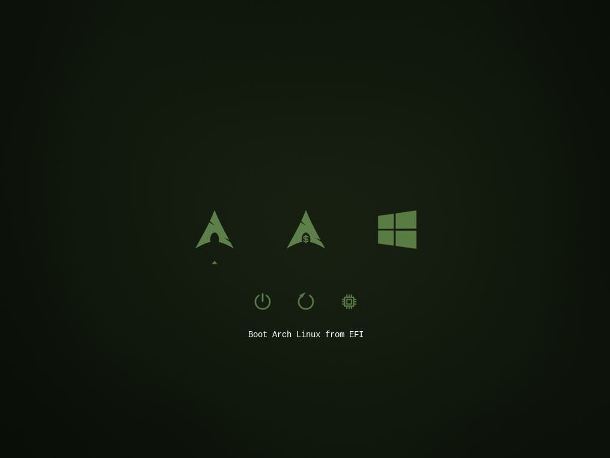
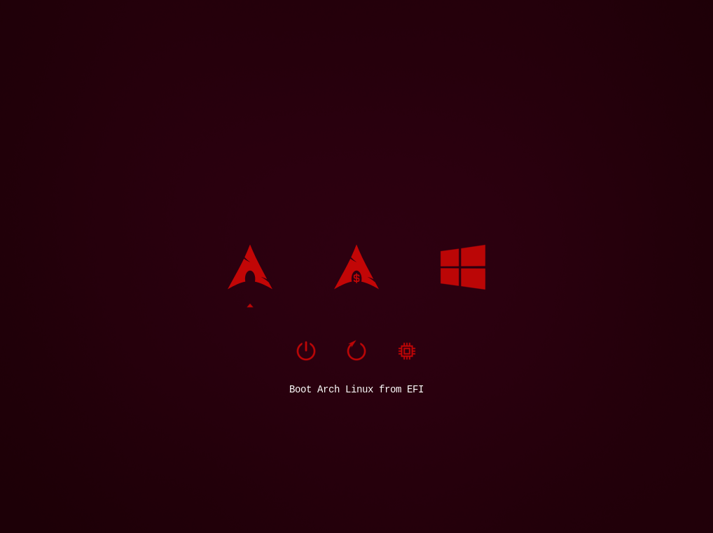
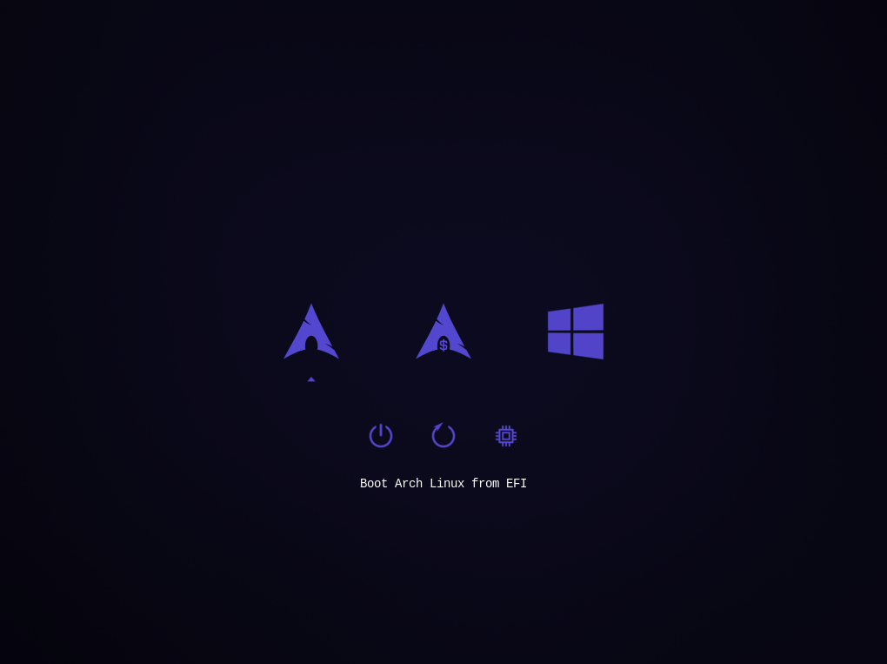

# refind-themegen

Generates a theme for the [rEFInd](http://www.rodsbooks.com/refind/) boot manager based on 
a set of icons and a background image from any RGB color.

Created entirely for my own use and amusment and should only be used at your own risk!

Most icons where taken from LightAir's [darkmini](https://github.com/LightAir/darkmini) theme
with added cli versions inspired by PillTimes's [rEFInd-minimal-dark](https://github.com/PillTime/rEFInd-minimal-dark) theme.

---

### Installtion

1. Clone this repository into a directory in your home folder or a similar location

2. Edit `createtheme.sh` and configure as you wish, Most important is to set the `themename` variable with your desired themename and the `newbasecolor` variable wich will determine the color of the theme. (if you just want to use the example theme skip to step...)

3. Make sure packages for bc, imagemagick and librsvg are installed. On arch `pacman -S bc imagemagick librsvg`.

4. When you're satisfied run the script from within the `refind-themegen` directory `./createtheme.sh`.

5. There should now be a directory with the generated theme in the the same directorty as the script. Examine the theme.conf file within and make sure everthing looks right and make any other adjustments you want.

6. Locate your refind directory, should most likely be `/boot/EFI/refind`. If it is somewhere else you'll have to modify the commands in teh following steps.

7.  Create a themes directory in your refind directory if one does not allerady exists and copy the generated theme or the example theme `refind-forrest` to that directory (you'll need to be root or use sudo)
`mkdir /boot/EFI/refind/themes`
`cp -r themename /boot/EFI/refind/themes/`

8. Add `include themes/themename/theme.conf` to the end of `/boot/EFI/refind/refind.conf`, if your using manual menu entries make sure to point to the correct icon.

```
menuentry "Arch" {
	icon /EFI/refind/themes/themename/icons/os_arch.png
	loader /vmlinuz-linux
	initrd /initramfs-linux.img
	options YOUR BOOT OPTIONS HERE
	disabled
}

menuentry "Arch - CLI" {
	icon /EFI/refind/themes/themename/icons/os_arch_cli.png
	loader /vmlinuz-linux
	initrd /initramfs-linux.img
	options YOUR BOOT OPTIONS HERE
	disabled
}
```

Autodetected entries should work but the icon will fallback to the default rEFInd icon if they don't exist in the theme.

## Examples

The example theme refind-forrest, create with `newbasecolor` 5d8147

Created with `newbasecolor` c30606

Created with `newbasecolor` 5548d1
